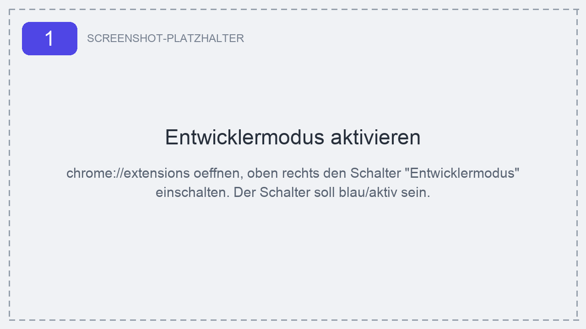
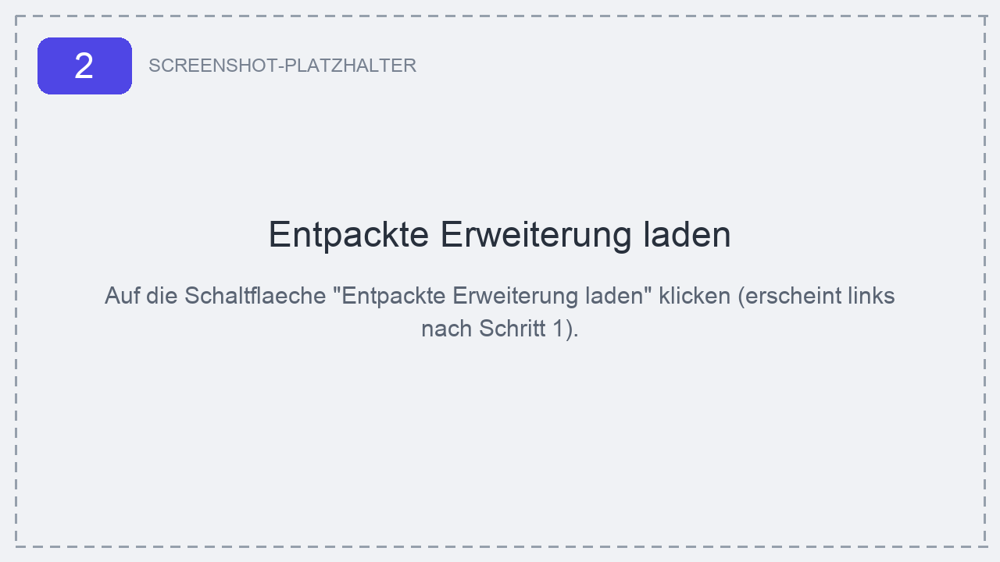
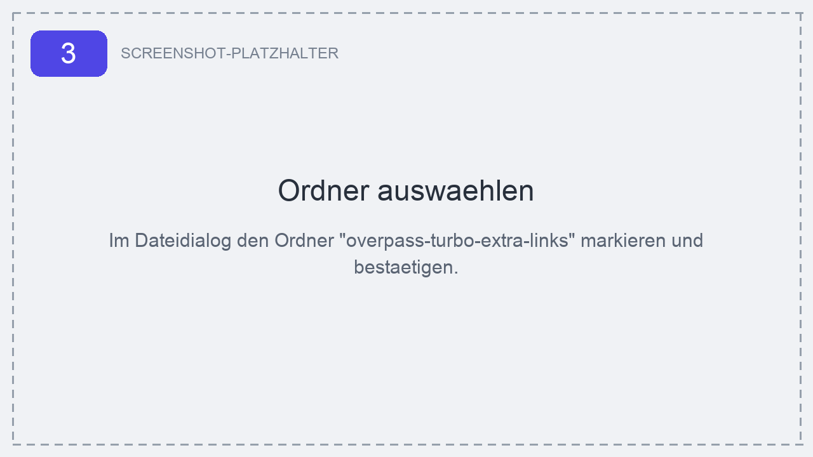
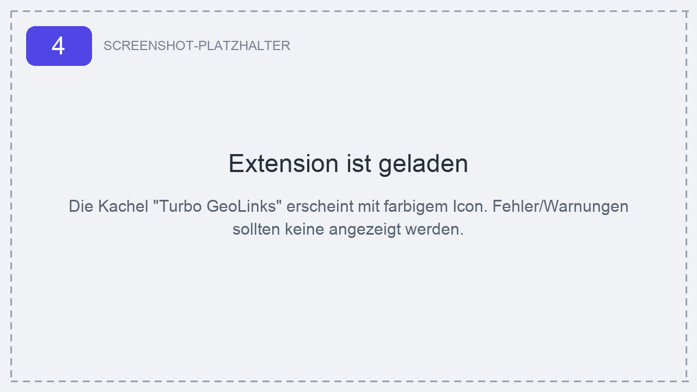
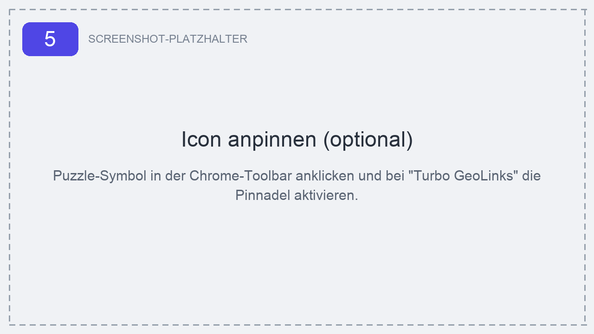
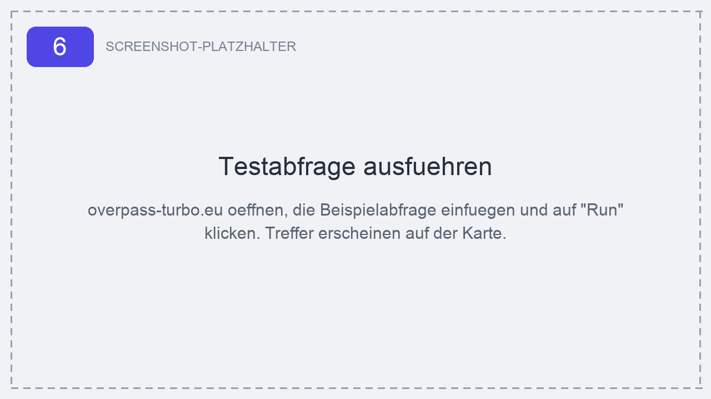

# Turbo GeoLinks – Installation & Nutzung

Diese Chrome-Erweiterung fügt im Ergebnis-Popup von **overpass-turbo.eu** zusätzliche
Links zu Kartendiensten und OSINT-Geolokalisierungs-Tools ein (Google Maps, Google
StreetView, Google Earth, Bing Maps, Yandex, Mapillary, GeoHack, SunCalc, Wikimapia u. a.).
Sie arbeitet rein clientseitig und ist unabhängig davon, welcher Overpass-API-Server
verwendet wird.

> **Voraussetzung:** Google Chrome oder ein Chromium-Browser (Edge, Brave, …) ab Version 111.

---

## Teil 1 – Installation

### Schritt 1: Erweiterungsseite öffnen und Entwicklermodus aktivieren
Öffne in Chrome die Adresse `chrome://extensions` und aktiviere oben rechts den
Schalter **„Entwicklermodus"**.



### Schritt 2: „Entpackte Erweiterung laden"
Klicke oben links auf die Schaltfläche **„Entpackte Erweiterung laden"**.



### Schritt 3: Ordner auswählen
Wähle im Dateidialog den Ordner **`overpass-turbo-extra-links`** aus (den Ordner, der
diese Anleitung und die Datei `manifest.json` enthält) und bestätige.



### Schritt 4: Fertig – Erweiterung ist geladen
Die Kachel **„Turbo GeoLinks"** erscheint nun mit farbigem Icon in der Liste. Es sollten
keine Fehler angezeigt werden.



### Schritt 5 (optional): Icon anpinnen
Klicke auf das **Puzzle-Symbol** in der Chrome-Toolbar und aktiviere bei „Turbo GeoLinks"
die **Pinnadel**, damit das Icon dauerhaft sichtbar ist. Ein Klick auf das Icon öffnet
später die Einstellungen.



---

## Teil 2 – Nutzung

### Schritt 6: Abfrage ausführen
Öffne [overpass-turbo.eu](https://overpass-turbo.eu), füge eine Abfrage ein und klicke
auf **„Run"**. Zum Ausprobieren eignet sich diese Beispielabfrage (Bänke und Gebäude in
Berlin-Mitte):

```
[out:json][timeout:25];
(
  node["amenity"="bench"](52.515,13.385,52.520,13.395);
  way["building"](52.515,13.385,52.520,13.395);
);
out body;
>;
out skel qt;
```



### Schritt 7: Treffer anklicken → Zusatzlinks erscheinen
Klicke auf der Karte auf einen Treffer (z. B. eine Bank oder ein Gebäude). Im sich
öffnenden Popup erscheinen **unten die zusätzlichen Links**. Ein Klick öffnet den
jeweiligen Kartendienst in einem neuen Tab – zentriert auf die Koordinaten des Objekts.


### Schritt 8: Links konfigurieren (Optionen)
Klicke auf das **Icon** in der Toolbar (oder Rechtsklick auf das Icon → **„Optionen"**).
Auf der Optionsseite kannst du:

- einzelne Links per **Checkbox** ein- oder ausschalten,
- die **Reihenfolge** mit den Pfeiltasten (↑ / ↓) anpassen,
- Änderungen mit **„Speichern"** übernehmen.


---

## Fehlerbehebung

- **Es erscheinen keine Zusatzlinks im Popup:** Öffne die Entwicklertools mit `F12`,
  wechsle auf den Reiter **„Console"** und prüfe auf Fehlermeldungen. Häufig hilft es,
  die Seite einmal neu zu laden (`F5`), nachdem die Erweiterung installiert wurde.
- **Bei Ways/Relations fehlen die Links:** Für Flächen/Linien werden die Center- bzw.
  Klick-Koordinaten verwendet. Klicke möglichst auf den markierten Mittelpunkt des Objekts.
- **Nach einem Update fehlen neue Dienste in den Optionen:** Neue Links werden automatisch
  ergänzt; bereits gespeicherte Reihenfolge und Ein/Aus-Zustände bleiben erhalten.
- **Änderungen am Code übernehmen:** Auf `chrome://extensions` bei der Kachel auf das
  **Aktualisieren-Symbol (↻)** klicken.

---

*Entwickelt von CY.*
