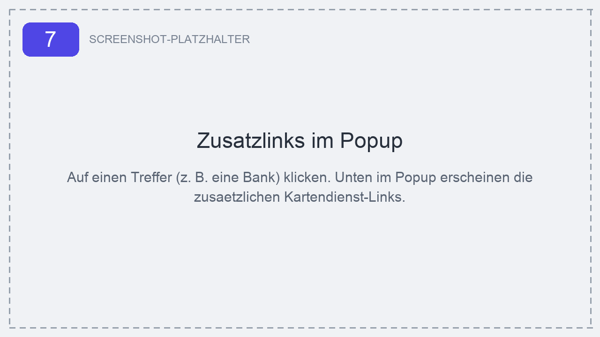
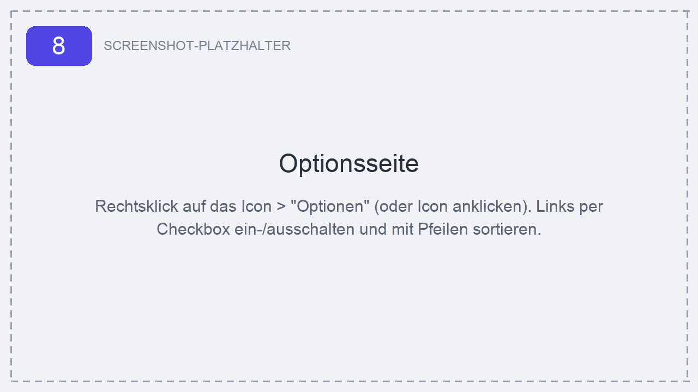

# Turbo GeoLinks

> Zusätzliche Kartendienst- und OSINT-Geolokalisierungs-Links direkt im Ergebnis-Popup von [overpass-turbo.eu](https://overpass-turbo.eu).


-green)


Wenn man auf Overpass Turbo einen Treffer (Node/Way/Relation) anklickt, öffnet sich ein
Leaflet-Popup mit Details zum Objekt. **Turbo GeoLinks** fügt dort unten eine Liste
zusätzlicher Links ein, die das Objekt in externen Kartendiensten öffnen – zentriert auf
seine Koordinaten. Praktisch für OSINT-Recherche, Georeferenzierung und Bildverifikation.

<p align="center">
  
</p>

---

## Highlights

- **15 Kartendienste & OSINT-Tools** – von Google Maps/StreetView bis GeoHack, SunCalc und Mapillary.
- **Serverunabhängig** – funktioniert auch mit einem **selbst gehosteten Overpass-API-Server**, weil die Koordinaten direkt aus dem bereits gerenderten Popup gelesen werden (kein Abfangen von Netzwerk-Antworten).
- **Datensparsam & sicher** – nur die Permission `storage`, kein `webRequest`/`declarativeNetRequest`, keine Datenübertragung an Dritte.
- **Konfigurierbar** – Links per Checkbox ein-/ausschalten und in der Reihenfolge anpassen.
- **Kein Build-Step** – reines Vanilla JS, direkt als „entpackte Erweiterung" ladbar.

---

## Enthaltene Links

| Dienst | Zweck |
|---|---|
| Google Maps | Standard-/Satellitenansicht |
| Google StreetView | Straßenpanoramen |
| Google Earth | 3D-Globus |
| Bing Maps | Luftbild/Hybrid |
| Yandex Maps | Satellitenkarte |
| Yandex StreetView | Straßenpanoramen (gute Abdeckung in Osteuropa) |
| InstantStreetView | Schneller StreetView-Einstieg |
| Dual Maps | Karte + StreetView + Luftbild nebeneinander |
| Map Channels | Mehrfach-Kartenansicht |
| Map Compare (bbbike) | Mehrere Kartenanbieter im Direktvergleich |
| Satellites Pro | Satellitenbilder |
| Mapillary | Crowdsourced Straßenfotos |
| GeoHack | Meta-Hub, verlinkt Dutzende weitere Karten-/Geodienste |
| SunCalc | Sonnenstand/Schattenwurf zu Datum & Uhrzeit (Zeit-Verifikation) |
| Wikimapia | POI-annotierte Satellitenkarte |

Alle Links sind über die Optionsseite einzeln abwählbar und sortierbar.

---

## Funktionsweise

Overpass Turbo baut die Ergebnis-Popups mit [Leaflet](https://leafletjs.com/) und stellt
`window.L` global bereit. Die Erweiterung nutzt zwei Content-Scripts:

1. **`content-scripts/page-world.js`** läuft im Seiten-Kontext (`"world": "MAIN"`) und
   hängt sich an `L.Popup.prototype.onAdd`. So liest sie die von Leaflet ohnehin
   berechnete Popup-Koordinate aus (Node-Position, Way-/Relation-Center oder der
   angeklickte Punkt) und hinterlegt sie als `data-`Attribut am Popup-Element.
2. **`content-scripts/content.js`** läuft im isolierten Content-Script-Kontext, beobachtet
   per `MutationObserver` neue Popups, liest die Koordinate (primär aus dem `data-`Attribut,
   als Fallback aus dem `geo:`-Link) und hängt die konfigurierten Links an.

Dadurch ist **kein Abfangen von Overpass-API-Antworten nötig** – die Erweiterung braucht
nur Zugriff auf `overpass-turbo.eu` selbst und ist unabhängig davon, welcher API-Server im
Hintergrund konfiguriert ist. Das ist der zentrale Unterschied zu Erweiterungen, die per
`webRequest` nur bekannte öffentliche Server-Domains abfangen und daher mit eigenen Servern
nicht funktionieren.

---

## Installation

> Ausführliche, bebilderte Schritt-für-Schritt-Anleitung: **[ANLEITUNG.md](ANLEITUNG.md)**
> (auch als [Anleitung.docx](Anleitung.docx) zum Weitergeben).

Kurzfassung (Chrome / Edge / Brave, ab Version 111):

1. Repository herunterladen bzw. klonen:
   ```bash
   git clone https://github.com/c3m462/TurboGeoLink.git
   ```
2. `chrome://extensions` öffnen und oben rechts den **Entwicklermodus** aktivieren.
3. **„Entpackte Erweiterung laden"** klicken und den Projektordner auswählen.
4. Optional: Über das Puzzle-Symbol in der Toolbar das Icon anpinnen.

---

## Nutzung

1. Auf [overpass-turbo.eu](https://overpass-turbo.eu) eine Abfrage ausführen. Zum Testen
   (Bänke und Gebäude in Berlin-Mitte):

   ```overpassql
   [out:json][timeout:25];
   (
     node["amenity"="bench"](52.515,13.385,52.520,13.395);
     way["building"](52.515,13.385,52.520,13.395);
   );
   out body;
   >;
   out skel qt;
   ```

2. Auf einen Treffer auf der Karte klicken → im Popup erscheinen unten die Zusatzlinks.
3. Ein Klick öffnet den jeweiligen Dienst in einem neuen Tab, zentriert auf das Objekt.

### Optionen

Klick auf das Toolbar-Icon (oder Rechtsklick → *Optionen*) öffnet die Einstellungsseite.
Dort lassen sich einzelne Links an-/abschalten und per ↑/↓ sortieren. Gespeichert werden
nur die Präferenzen (Reihenfolge + Ein/Aus) via `chrome.storage.sync`; Labels und URLs
kommen immer aus dem Code, sodass Updates automatisch greifen.

<p align="center">
  
</p>

---

## Berechtigungen & Datenschutz

- Einzige Permission: **`storage`** (zum Speichern der Link-Einstellungen).
- **Kein** `webRequest`/`declarativeNetRequest`, **kein** Abfangen von Netzwerkverkehr.
- Es werden **keine Daten** an den Autor oder Dritte gesendet. Koordinaten werden lokal im
  Browser aus dem Popup gelesen und nur beim Klick als Teil der Ziel-URL an den jeweils
  gewählten Kartendienst übergeben.
- Content-Script läuft ausschließlich auf `https://overpass-turbo.eu/*`.

---

## Projektstruktur

```
.
├── manifest.json              # Manifest V3
├── background.js              # Service Worker: öffnet Optionen beim Icon-Klick
├── content-scripts/
│   ├── page-world.js          # MAIN world: liest Leaflet-Popup-Koordinaten
│   ├── content.js             # isolierte Welt: fügt Links ins Popup ein
│   └── content.css
├── options/                   # Optionsseite (HTML/CSS/JS)
├── shared/
│   └── default-links.js       # Link-Definitionen + Prefs-Logik (geteilt)
├── icons/                     # 16/48/128 px
├── screenshots/               # Bilder für die Anleitung
├── ANLEITUNG.md               # bebilderte Installations-/Nutzungsanleitung
└── README.md
```

Neue Links hinzufügen: einen Eintrag in [`shared/default-links.js`](shared/default-links.js)
ergänzen (`id`, `label`, `urlTemplate`). Platzhalter im Template: `{lat}`, `{lon}`,
`{latAbs}`, `{lonAbs}`, `{latHem}`, `{lonHem}`, `{date}`, `{time}`.

---

## Danksagung

- [tyrasd/overpass-turbo](https://github.com/tyrasd/overpass-turbo) – das großartige Tool, auf dem diese Erweiterung aufsetzt.
- [Northern-Palmyra/Overpass-turbo-extension](https://github.com/Northern-Palmyra/Overpass-turbo-extension) – „Overpass-Turbo StreetView", Inspiration für dieses Projekt; ein Teil der Kartendienst-URL-Formate ist daran angelehnt.

Diese Erweiterung steht in keiner Verbindung zu Overpass Turbo, Google, Microsoft, Yandex
oder den übrigen verlinkten Diensten. Alle Marken gehören ihren jeweiligen Eigentümern.

---

## Lizenz

Veröffentlicht unter der [MIT-Lizenz](LICENSE) – © 2026 CY.

---

*Entwickelt von CY.*
